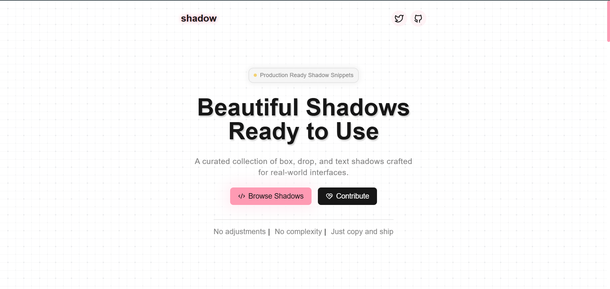
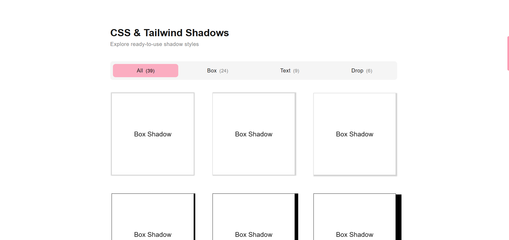

# Shadow 

A curated collection of box, drop and text shadows which are ready to use as Tailwind and Vanilla css.

## Preview

<p align="center">
  
  <br/><br/>
  
</p>

## Features

- Production ready shadow snippets
- More than 30+ collections of drop, box and text shadows
- Open source
- Responsive design
- Clean modern UI

## Live Demo

https://shadow-mee.vercel.app

## Installation

Clone the repository:

```bash
git clone https://github.com/daman599/shadow.git
```

Go to the project folder:

```bash
cd shadow
```
Install dependencies:

```bash
npm install 
```

Start development server:
```bash
npm run dev
# or
yarn dev
# or
pnpm dev
# or
bun dev
```
Open [http://localhost:3000](http://localhost:3000) with your browser to see the result.

## Contributing

Contributions are welcome!

If you'd like to:

- Add new shadows
- Improve UI
- Fix bugs

Feel free to fork and raise a pull request.

## Author

Built with ❤️ by Daman
